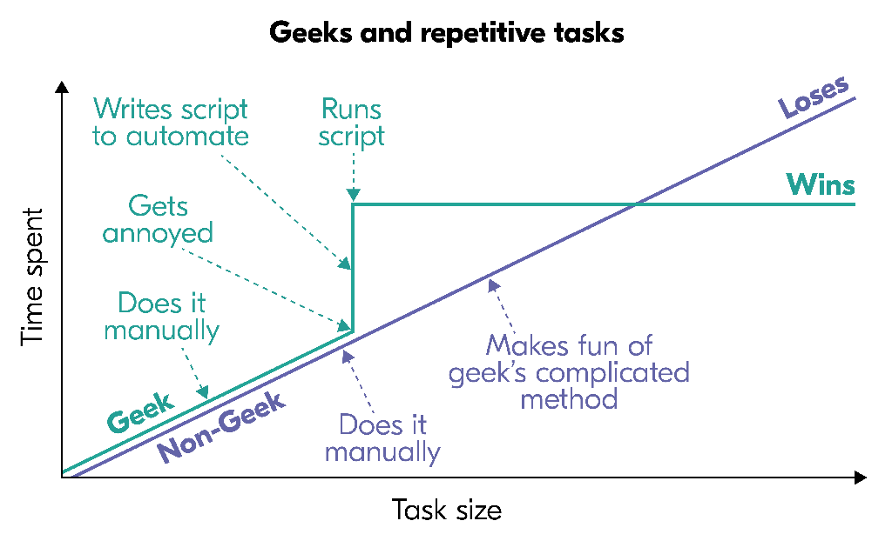
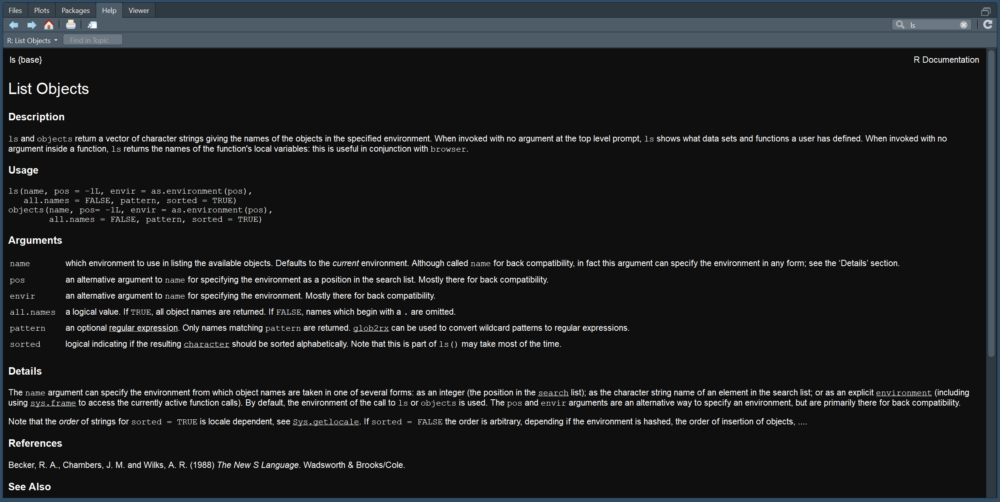

<script src="https://ajax.googleapis.com/ajax/libs/jquery/3.2.1/jquery.min.js"></script>

<script type="text/javascript">
  $(document).ready(function() {
    $('slides').prepend("<div class=\"zoomDiv\"></div>");
    // onClick function for all plots (img's)
    $('img:not(.zoomImg)').click(function() {
      $('.zoomImg').attr('src', $(this).attr('src'));
      $('.zoomDiv').css({opacity: '1', width: '90%'});
    });
    // onClick function for zoomImg
    $('img.zoomImg').click(function() {
      $('.zoomDiv').css({opacity: '0', width: '0%'});
    });0
  });
</script>

```{r setup, echo=FALSE}
library(knitr)
opts_chunk$set(fig.align = "center",
               fig.retina = 2,
               fig.width = 10,
               fig.asp = 0.7,
               cache = TRUE,
               cache.lazy = FALSE,
               results = 'hold')
```

# Bioinformatique

## Plan général du cours

Contenu:

1) Bases de bioinformatique et quelques applications sur l’étude des séquences nucléotidiques
<br>8h S. Maury
2) Bases en informatique et applications bioinformatiques pour la génomique
<br>4h O. Rogier et 4h A. Chateigner

## Plan de la partie 2

* TD 5 : bases informatiques et programmation
    * Structure d'un ordinateur, fonction des composants
    * Les langages de programmation : bash (awk, sed), python/perl, R - (C/C++)
* TD 6 : Du fasta au bam
    * Notions de pipeline, scripts, outils de bio-info pure (samtools)
    * Visualisation (gbrowse, IGV) et calling, détection de polymorphisme
* TD 7 : R des bases à l'analyse transcriptomique
    * R : bases, rapports, reprise des scripts bash à intégrer
    * R : RNAseq, analyses de données d'expression
* TD 8 : Ontologie, prédictions et évaluation
    * R : ontologies, prédictions et retour à la bio
    * Finish du script, réflexion sur la suite
    
# Go go go!

# R

## R, kessessé ?

* Langage de programmation
* Environnement mathématique

* Pour faire quoi ?
    * Traitement de données
    * Analyse statistique
    * Graphiques

## Les spécificités de R

* Environnement intégré
* Langage de programmation complet et autonome
* Interprété (pas compilé comme C)
* Puissant en mathématiques et statistiques
* Multiplateforme
* Libre et ouvert

* De plus
    * Langage **vectorisé** <-- Super super super important

## Ouvrons R

* Ouvrez un terminal
* Tapez R <div class="topright"></div>
* C'est pas folichon,<br>mais ça fait quoi ?

## Premières commandes

```{r erreurs hello world, error=TRUE, cache = FALSE}
Hello world!
```

```{r premières choses authorisees}
print("Hello world!")
2 + 3; 2 - 3; 2 * 3; 2 / 3; 2 ** 3; 2 ^ 3
```

## Objets et assignations

```{r premiers objets}
a <- 2
b <- 3
a + b; a - b; a * b; a / b; a ** b; a ^ b
```

## Objets et assignations

On peut réutiliser un objet:
```{r reutilisation dobjet}
a <- 1
a
a <- 2
a
a ** b
```

## Et à la fin

* Question : on garde quoi à la fin ?
    * Les objets créés ? `a ** b`
    * Le code ?
* Code réel et objets virtuels
    * Garder le code permet de refaire toute une analyse
    * On garde le code dans des scripts
    * Contiennent toute la démarche
    * Gain d'espace de stockage

# Les scripts

## Sauvegarder l'avancée de son travail : le script

* Programmation: A quoi ça sert ? <div></div>
* Gain de temps
* Répétition de tâches
* Tracabilité

## Sauvegarder son travail en mieux : le rapport ! {.build}

* Traçabilité des actions (pas de clic clic)
* Regrouper code et résultats
* Faire un rapport quoi...
* Ouvrons RStudio

<div></div>
<div class="notes">
Décrire la fenêtre
Parler en dernier de la fenêtre de script
UTF-8
</div>

## Rmarkdown

* `R` + `markdown` (langage à balisage léger)
* Code `R` et commentaires

* Faisons tout de suite un rapport qui a :
    * Des titres structurés et numérotés
    * Une table des matières
    * Des chunks avec des noms
    * Du code
    * Qu'il produise un rapport html
    * Que sa date soit automatique
        * date: "`` `r
        substr(Sys.time(), 1, 10)` ``"

## Un rapport structuré : exemple et évaluation {.build}

https://bit.ly/m2BICGRapport

<div>Tâche fil rouge : rapport de la partie 2 du cours</div>
<div>**--> Evaluation**</div>

# Back to the futuRe

## Rappel

```{r rappel}
print("Hello world!")
a <- 2; b <- 3
a ** b
```


## Répertoire de travail {.build}

* Dossier dans lequel vous travaillez
* Même endroit que votre script/rapport
* Implique que les objets soient placés par rapport à lui

<div> Exemple, pour lire un fichier csv:
```{r lire un fichier, eval=FALSE}
# bien
objet1 <- read.csv(file = "dossier/fichier1.csv")
# pas bien
objet1 <- read.csv(file = "C:/User/achateigner/Documents/.../dossier/fichier1.csv")
```
</div>

## Aide {.build}

Plusieurs méthodes :

* dans R :
<div>
```{r aide R, eval=FALSE}
?ls
help("ls")
```
</div>

* dans Rstudio : 

## Les fonctions

* En R, une fonction s'écrit avec des parenthèses, e.g. `ls()`
* Beaucoup déjà écrites
* Vous pouvez faire les vôtres
    * Partage simple sur github
    * Partage sous forme de package sur CRAN et Bioconductor

## Les packages {.build}

* Ajout de nouvelles fonctions
* Doivent être chargés pour utiliser directement leurs fonctions
* On peut aussi appeler directement `Package::fonction()`
* 3 répertoires principaux : CRAN, Bioconductor, github
* 1 package pour les installer tous : anyLib

<div>
```{r installation et chargement, eval=FALSE}
# Installation classique
install.packages("anyLib")
# Chargement d'un paquet
library(anyLib)
# Avec anyLib, les deux d'un coup
anyLib("apercu")
```
</div>

<div style="position: absolute; bottom: -30px; left: 61px; width: 100%">
```{r installation bioconductor, eval=FALSE}
# Installation avec bioconductor
# d'abord, on installe bioconductor
if (!requireNamespace("BiocManager"))
    install.packages("BiocManager")
BiocManager::install()
# ensuite on installe le paquet
BiocManager::install("coseq")
# enfin on le charge
library(coseq)
# Avec anyLib :
anyLib("coseq")
```
</div>

<div style="position: absolute; bottom: -32px; left: 61px; width: 100%; height: 50%; background-color: #e6e6e6">
```{r installation github, eval=FALSE}
# Installation avec github
# D'abord, il faut le paquet devtools
install.packages("devtools")
# Ensuite on le charge
library(devtools)
# Enfin on installe le package
install_github("achateigner/loadAllChunksCache")
# Avec anyLib
anyLib("achateigner/loadAllChunksCache")
```
</div>

## Les packages

> * Ajout de nouvelles fonctions
> * Doivent être chargés pour utiliser directement leurs fonctions
> * On peut aussi appeler directement `Package::fonction()`
> * 3 répertoires principaux : CRAN, Bioconductor, github
> * 1 package pour les installer tous : anyLib

Vous pouvez aussi les installer et charger en clic clic mais :

* Bonjour la tracabilité
* C'est moins swag

## anyLib

```{r anyLib, eval=FALSE}
install.packages("anyLib")
library(anyLib)
packagesNeeded <- list("captioner", "apercu", "viridis")
anyLib(packagesNeeded)
```

- Permet d'installer/de charger plusieurs packages à la fois
- Permet de les installer du CRAN, de bioconductor ou de github en 1 fois
- Renvoie un vecteur de booléen nommé de réussite ou d'échec

# Import/Export

## Sauver des objets et une session {.build}

* Quand on veut sauvegarder son travail on peut sauver une image de session :
```{r save image}
save.image(file = "nomDeLObjetSession.rda")
```


* On peut aussi sauver les objets directement
```{r save file}
save(a, file = "nomDeLObjet.rda")
```


* Ou encore sauver un fichier texte, un tableau
```{r write txt and table}
write(a, file = "fichierTexte.txt")
matrice <- matrix(1:4, ncol = 2)
write.table(matrice, file = "matrix.csv")
write.csv(matrice, file = "matrix2.csv")
```

## Importer des objets ~~d'Aliexpress~~ {.build}

* Quand on veut charger une ancienne session
```{r load image}
load(file = "nomDeLObjetSession.rda")
```

* Quand on veut charger un objet, même chose
```{r load object}
load(file = "nomDeLObjet.rda")
```

* Quand on veut charger un fichier texte ou un tableau
```{r load txt and table, eval = FALSE}
read.table("fichierTexte.txt")
matrice <- read.table(file = "matrix.csv")
matrice2 <- read.csv(file = "matrix2.csv", row.names = 1)
```

# Les bases de la syntaxe

## Les commandes R

L'utilisateur interagit avec l'interprète R en entrant une commande :

- Soit une expression
- Soit une affectation

## Les commandes R

L'utilisateur interagit avec l'interprète R en entrant une commande :

> - Soit une expression
```{r expressions}
2 + 3
pi
cos(pi / 4)
```

## Les commandes R

L'utilisateur interagit avec l'interprète R en entrant une commande :

> - Soit une expression
> - Soit une affectation
```{r affectations}
a <- 5
a
b <- a
b
(a <- 2 + 3)
```

## Quelques détails {.build}

- -> = ;
- Regroupement de commandes avec {} :
```{r}
{
    a <- 2 + 3
    b <- a
    b
}
```
- Résultat de la dernière commande

## Conventions de noms

- Autorisés : A-Za-z0-9._
- Autorisés mais déconseillés : les caractères accentués
- Interdit : démarrer par un chiffre
- Interdit : démarrer par .[0-9]
- Sensible à la casse : foo =/= Foo
- Déconseillé : réutiliser des noms de R (c, q, t, C, D, I, diff, length, mean...)
- Mots interdits car réservés :
    - break, else, for, function, if, in, next, repeat, return, while,
    - TRUE, FALSE,
    - Inf, NA, NaN, NULL,
    - NA_integer_, NA_real_, NA_complex_, NA_character_,
    - ..., ..1, ..2, etc.

## TRUE or FALSE {.build}

- T veut dire TRUE
- F veut dire FALSE
- Mais préférez TRUE et FALSE car
```{r true or false, error=TRUE, cache=FALSE}
TRUE <- 3
T <- 3
```


# Les objets

## Les objets

Tout en R est un objet :
- Les variables contenant des données
- Les fonctions
- Les opérateurs
- Même le symbole représentant le nom d'un objet

Ils ont :
- Un mode (unique)
- Une longueur
- Des attributs (facultatif)

```{r mode et longueur}
v <- c(1, 2, 5, 9)
mode(v)
length(v)
```

## Modes et types de données

```{r tableau des modes, include=FALSE}
tableauModes <- data.frame(matrix(c("numeric", "nombres réels", "complex", "nombres complexes", "logical", "valeurs booléennes (vrai/faux)", "character", "chaînes de caractères", "function", "fonction", "list", "données quelconques", "expression", "expressions non évaluées"), ncol = 2, byrow = TRUE))
colnames(tableauModes) <- c("Mode", "Contenu de l'objet")
```


```{r modes et types de donnees, echo = FALSE}
knitr::kable(tableauModes)
```

## Objets simples ou récursifs

- Objets simples : numeric, complex, logical et character = 1 seul type de données
- Objets récursifs : list et expression = peuvent contenir d'autres objets

- `typeof` : description de la représentation internet d'un objet, comment il est stocké
- `class` : description qui nous intéresse, un objet peut en avoir plusieurs


## Longueur

Egal au nombre d'éléments contenus dans l'objet

```{r longueur chaines de caracteres}
v1 <- "actuariat"
length(v1)
nchar(v1)
v2 <- c("a", "c", "t", "u", "a", "r", "i", "a", "t")
length(v2)
nchar(v2)
v <- numeric(0) #objet vide
length(v)
```

## NULL

Objet spécial, représentant "rien", le vide

```{r null}
typeof(NULL)
class(NULL)
length(NULL)
identical(NULL, numeric(0))
is.null(NULL)
```

## Données manquantes : `NA` {.build}

- logical mais ni `TRUE` ni `FALSE`
- toute opération l'impliquant a pour résultat `NA`
- `na.rm`
```{r na ope}
NA == NA
is.na(NA)
```

## Autres valeurs spéciales

- `Inf` et `-Inf`
- NaN : not a number
- `is.infinite`, `is.finite`, `is.nan`

## Attributs

Eléments d'information additionnels d'un objet

```{r attributs, echo = FALSE}
tableauAttributs <- data.frame(matrix(c("class", "affecte le comportement d’un objet", "dim", "dimensions des matrices et tableaux", "dimnames", "étiquettes des dimensions des matrices et tableaux", "names", "étiquettes des éléments d’un objet"), ncol = 2, byrow = TRUE))
colnames(tableauAttributs) <- c("Attribut", "Utilisation")
knitr::kable(tableauAttributs)
```

## Attributs

```{r manipulation dattributs}
x <- 3
attr(x, "methode") <- "au pif"
attributes(x)
dim(x)
attr(x, "methode") <- NULL
attributes(x)
```

# Vecteurs, matrices, tableaux, listes et data frames

## Vecteurs

- En R, tout est vecteur. C'est l'unité de base dans les calculs
- Tous les éléments doivent être du même mode
- Fonctions de base de création de vecteur :
    - `c`
    - `numeric`
    - `logical`
    - `character`

## Vecteurs {.build}

On peut donner une étiquette/un nom à chaque élément
```{r vecteurs}
(v <- c(a = 1, b = 2, c = 5))
v <- c(1, 2, 5)
names(v) <- c("a", "b", "c")
v
```


## Matrices et tableaux

> - Matrice = vecteur avec un attribut `dim` de longueur 2

```{r matrices, results = 'hold'}
attr(x, "dim") <- c(1, 1)
class(x)
matrix(1:6, nrow = 2, ncol = 3)
(m <- matrix(1:6, nrow = 2, ncol = 3, byrow = TRUE))
```

## Matrices et tableaux

> - Tableaux = vecteur à plus de 2 dimensions

```{r array}
attr(x, "dim") <- c(1, 1, 1)
class(x)
(a <- array(1:24, dim = c(3, 4, 2)))
```
- Convension de remplissage par colonne
<div></div>

## Listes {.build}

- Vecteur spécial
- Elements de n'importe quel mode (même liste)
- Mode de stockage le plus polyvalent
```{r listes}
(l <- list(size = c(1, 5, 2), user = "Joe", new = TRUE))
```

## Data frames {.build}

- Matrice spéciale, en réalité une liste d'éléments de même longueur
- De classe `data.frame`
- Matrice avec colonnes de modes différents
- `data.frame()` et `as.data.frame()`
- `rbind()` et `cbind()`
```{r}
d <- data.frame(num = 1:3, letter = letters[1:3])
```

# Indiçage

## Indiçage des vecteurs

```{r indicage des vecteurs}
v[3]
v["c"]
v["c"] <- 10
v
```

## 5 manières d'indicer un vecteur

```{r manieres dindicer}
x <- c(A = 2, B = 4, C = -1, D = -5, E = 8)
x[c(1, 3)] #1
x[c(-2, -3)] #2
x > 0
x[x > 0] #3
x[c("B", "D")] #4
x[] #5
```


## Indiçage des matrices et tableaux

```{r indicage des matrices et arrays}
m[1,2]
m[3]
m[2,]
a[1,1,1]
```

## Indiçage des listes

```{r indicage des listes}
l[1]
l[[1]]
l$size
l[c(1,2)]
l[[c(1,2)]]
l$size[2]
unlist(l)
```

## Indiçage des data frames

```{r indicage des data frames}
d[1]
d[1:2]
d[1,1]
d$num
d$num[1]
d[[c(2,1)]]
d[c(2,1)]
d[2][[1]][1]
```

## Bonus de l'indicage

```{r bonus indicage, eval = FALSE}
?`[`
?`[<-`
`[`
?`$`
?`$<-`
```


# Le problème

## Okay {.build .smaller}

- Une ligue de hockey compte huit équipes.
- Le classement de la ligue est disponible quotidiennement dans le journal
- Afin d’effectuer différentes analyses statistiques, on désire intégrer ces données dans un espace de travail R.
- On doit donc déterminer le type d’objet R approprié pour stocker le classement de la ligue.
- Ensuite, on souhaite extraire les valeurs suivantes de l’objet précédemment créé :
    1. Le nombre d’équipes de la ligue.
    1. La fiche complète de l’équipe de Montréal.
    1. La fiche complète de l’équipe à la septième position du classement.


# Machine learning

# Les graphiques

https://bioinfo-fr.net/cours-de-r-pour-debutant-presse-intro</br>
https://bioinfo-fr.net/cours-de-r-pour-debutant-presse-deuxieme-episode</br>
https://bioinfo-fr.net/cours-de-r-pour-debutant-presse-les-regressions</br>


