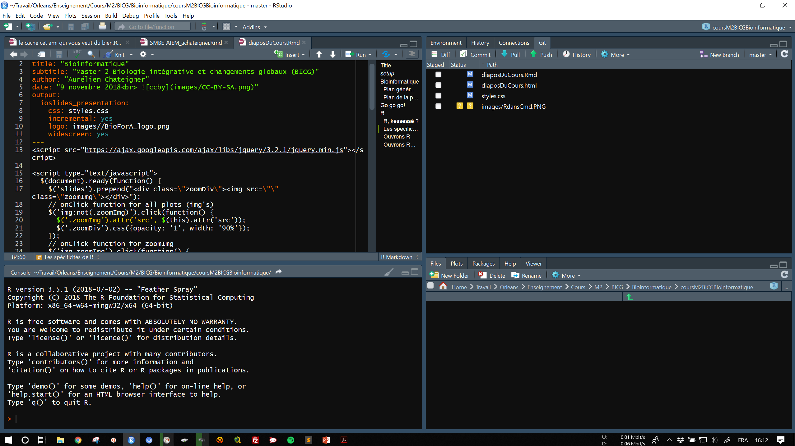

<script src="https://ajax.googleapis.com/ajax/libs/jquery/3.2.1/jquery.min.js"></script>

<script type="text/javascript">
  $(document).ready(function() {
    $('slides').prepend("<div class=\"zoomDiv\"></div>");
    // onClick function for all plots (img's)
    $('img:not(.zoomImg)').click(function() {
      $('.zoomImg').attr('src', $(this).attr('src'));
      $('.zoomDiv').css({opacity: '1', width: '90%'});
    });
    // onClick function for zoomImg
    $('img.zoomImg').click(function() {
      $('.zoomDiv').css({opacity: '0', width: '0%'});
    });0
  });
</script>

# Bioinformatique

## Plan général du cours

Contenu:

1) Bases de bioinformatique et quelques applications sur l’étude des séquences nucléotidiques
<br>8h S. Maury
2) Bases en informatique et applications bioinformatiques pour la génomique
<br>4h O. Rogier et 4h A. Chateigner

## Plan de la partie 2

* TD 5 : bases informatiques et programmation
    * Structure d'un ordinateur, fonction des composants
    * Les langages de programmation : bash (awk, sed), python/perl, R - (C/C++)
* TD 6 : Du fasta au bam
    * Notions de pipeline, scripts, outils de bio-info pure (samtools)
    * Visualisation (gbrowse, IGV) et calling, détection de polymorphisme
* TD 7 : R des bases à l'analyse transcriptomique
    * R : bases, rapports, reprise des scripts bash à intégrer
    * R : RNAseq, analyses de données d'expression
* TD 8 : Ontologie, prédictions et évaluation
    * R : ontologies, prédictions et retour à la bio
    * Finish du script, réflexion sur la suite
    
# Go go go!

# R

## R, kessessé ?

* Langage de programmation
* Environnement mathématique

* Pour faire quoi ?
    * Traitement de données
    * Analyse statistique
    * Graphiques

## Les spécificités de R

* Environnement intégré
* Langage de programmation complet et autonome
* Interprété (pas compilé comme C)
* Puissant en mathématiques et statistiques
* Multiplateforme
* Libre et ouvert

* De plus
    * Langage **vectorisé** <-- Super super super important

## Ouvrons R

* Ouvrez un terminal
* Tapez R <div class="topright"></div>
* C'est pas folichon, mais ça fait quoi ?

## Premières commandes

```{r erreurs hello world, error=TRUE}
Hello world!
```

```{r premières choses authorisees, results='hold'}
print("Hello world!")
2 + 3; 2 - 3; 2 * 3; 2 / 3; 2 ** 3; 2 ^ 3
```

## Objets et assignations

```{r premiers objets, results='hold'}
a <- 2
b <- 3
a + b; a - b; a * b; a / b; a ** b; a ^ b
```

## Objets et assignations

On peut réutiliser un objet:
```{r}
a <- 1
a
a <- 2
a
```

# Les scripts

## Sauvegarder l'avancée de son travail : le script

* Programmation: A quoi ça sert ? <div></div>
* Gain de temps
* Répétition de tâches
* Tracabilité

## Sauvegarder son travail en mieux : le rapport ! {.build}

* Traçabilité des actions (pas de clic clic)
* Regrouper code et résultats
* Faire un rapport quoi...
* Ouvrons RStudio

<div></div>
<div class="notes">
Décrire la fenêtre
Parler en dernier de la fenêtre de script
</div>

## Rmarkdown

* `R` + `markdown` (langage à balisage léger)
* Code `R` et commentaires

* Faisons tout de suite un rapport qui a :
    * Des titres structurés et numérotés
    * Une table des matières
    * Des chunks avec des noms
    * Du code
    * Qu'il produise un rapport html
    * Que sa date soit automatique
        * date: "`` `r
        substr(Sys.time(), 1, 10)` ``"


## Sauver des objets et une session

* Quand on veut sauvegarder son travail on peut sauver une image de session :
```{r save image}
save.image(file = "nomDeLObjetSession.rda")
```

* On peut aussi sauver les objets directement
```{r save file}
save(a, file = "nomDeLObjet.rda")
```

* Ou encore sauver un fichier texte, un tableau
```{r write txt and table}
write(a, file = "fichierTexte.txt")
matrice <- matrix(1:4, ncol = 2)
write.table(matrice, file = "matrix.csv")
```


